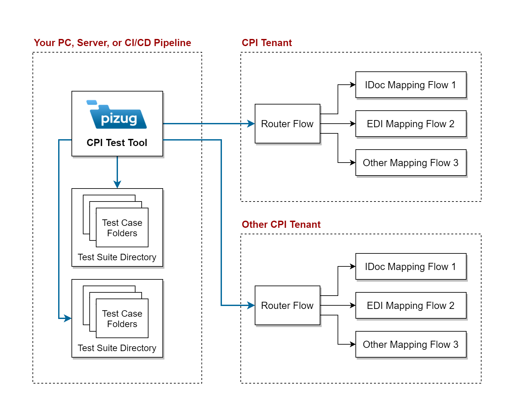

# Pizug Test Tool for SAP CPI

This tool helps developers to focus on CPI mapping development, providing a fast feedback loop for multiple cases in the same mapping.

While it is best for complex mapping development, it can also be used for regression tests on developers' computers or on the server, CI/CD pipeline in an automated way.

You can store your test data forever in a human-readable format.

## Prerequisites
Currently, the only prerequisite is separating your complex mappings to a [Mapping Flow](https://blogs.sap.com/2020/09/13/two-types-of-cpi-mapping-flows/). The tool works everywhere Java works. You can use your Raspberry Pi to test CPI!

## Installation & Usage

- Obtain Java 11
  - You can download OpenJDK zip from [Red Hat here](https://developers.redhat.com/products/openjdk/download), For example: `jre-11.0.8-x64 ZIP | JRE 11 Windows 64-bit` (47MB)
- Download `pizug-cpi-mapping-test.jar` file from [the latest release](https://github.com/pizug/cpi-mapping-test/releases/latest)
- Deploy router flow to your CPI tenant. Note HTTP sender address.
- Prepare test cases & `pizug-test.yaml` test suite configuration file
- Run test suite with `C:\path\to\java -jar C:\path\to\pizug-cpi-mapping-test.jar` in the folder

## Passwords

You can't write passwords to the configuration file. This is to prevent committing passwords if you are using Git or sharing your test suite with eg. FTP, OneDrive/SharePoint, Dropbox.

You can run the tool with the option `--password` and it will ask for your password without showing it in the terminal.

You can define an environment variable name. For a test suit config containing:
`password_environment_variable: "CPI_PASSWORD"` , you can set the environment variable for the terminal session as below and run the tool multiple times without requiring passwords. You can also use this method for CI/CD pipelines.

The tool will look for both passwords and pick environment variable over console provided password. If you haven't defined any, it will give error. If your password is incorrect processing will be stopped after the first call to prevent locking S-user password. (After 5 consecutive failed attempts S-user password gets locked for 1 hour)

### Setting environment variable

For Windows Powershell:

`$env:CPI_PASSWORD="yourpass"`

For Windows cmd.exe:

`set CPI_PASSWORD=yourpass`

For Linux:

`export CPI_PASSWORD=yourpass`

## Example

You can find the example test suite in `/example-test-data` folder.

## Changelog

See [CHANGELOG.md](CHANGELOG.md)

## Blog Posts

- Announcement & usage:
  <https://blogs.sap.com/2020/08/25/an-open-source-cpi-mapping-test-tool-pizug-test/>
